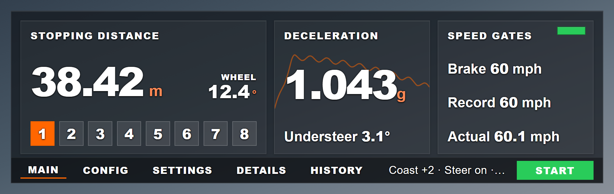
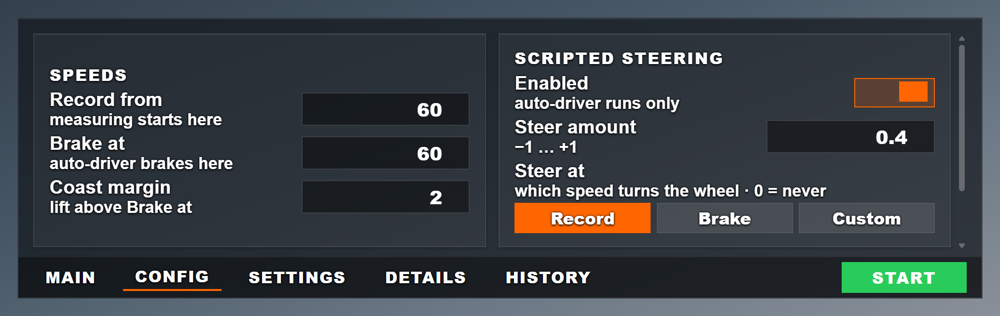
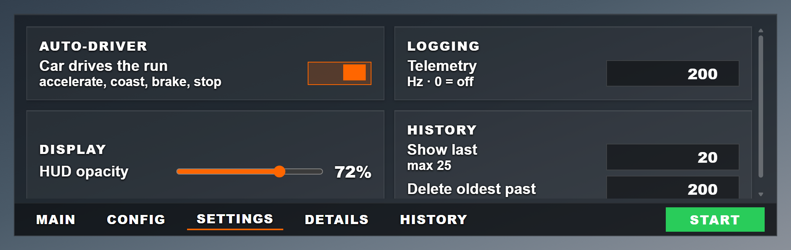
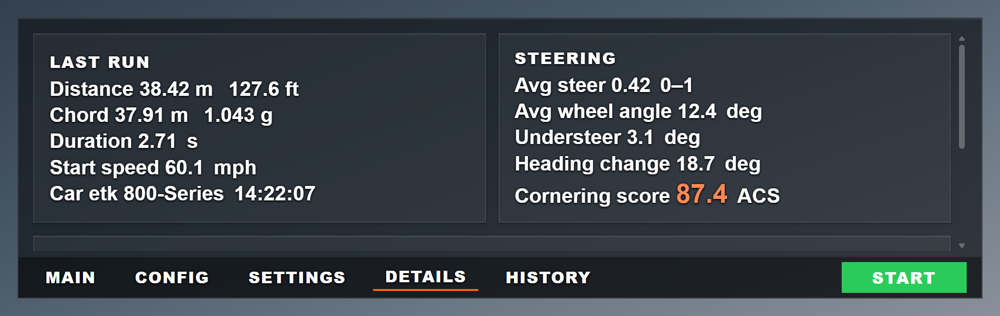
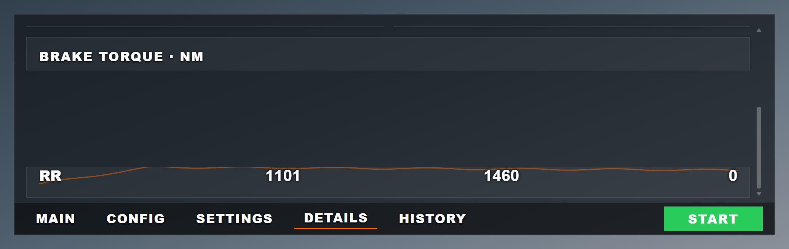
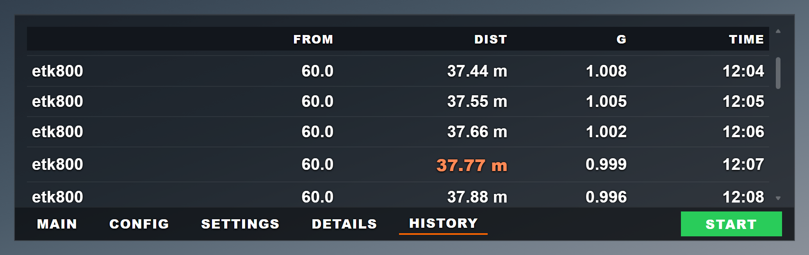
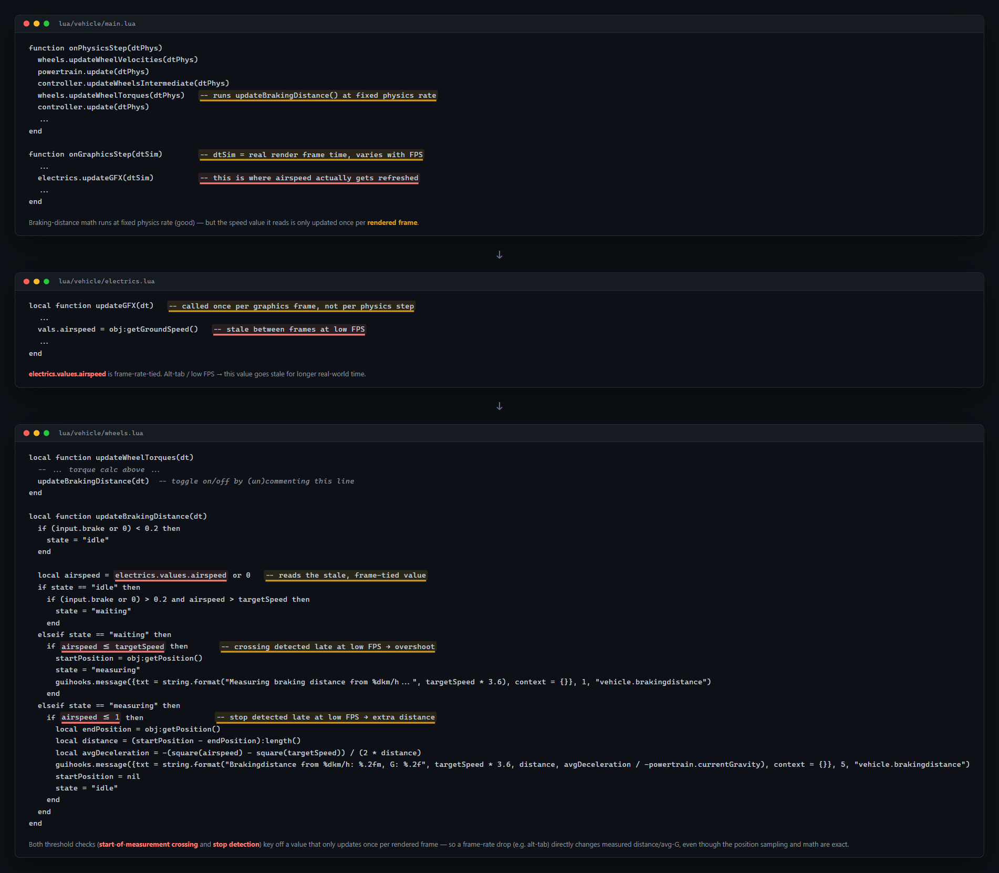

# BrakeTest GUI

Standalone BeamNG.drive brake test mod. Set a target speed, get a measured stop back with
distance, average G and duration. Split out from the DynamicABS mod family because it has
no dependency on ABS-controller internals.

## Why this exists

I was building and comparing ABS controllers, and the stopping distances would not
repeat. Same car, same road, same target speed, and results that moved around far too much
to rank one controller against another.

I assumed BeamNG's built-in brake distance test was solid enough to use as a baseline,
until the spread between runs that should have been identical passed **0.20 g**. That is
larger than the difference between the controllers I was trying to tell apart, which makes
the measurement useless for the job.

The cause was in the stock tester, not the cars. It reads speed from a value that refreshes
once per rendered frame, so the frame rate decides exactly when the test believes you
crossed the target speed. The same physical stop measures differently depending on what the
renderer happens to be doing. Details in [the section below](#the-bug-in-stock-beamngs-version).

This mod measures on the **vehicle** Lua VM at 2 kHz, one sample per physics step, never on
the render thread. Frame rate stops being an input to the result.

---

## The HUD

Five tabs. Every control maps to a specific Lua line; the table is in
[docs/GUI_TERMINOLOGY.md](docs/GUI_TERMINOLOGY.md).

The window is aspect-locked to 3.4260:1 via `preserveAspectRatio` in `app.json`, so it
resizes freely but never reaches a shape the layout was not designed for. Type and spacing
scale with the window using CSS container queries. See [docs/UI_SIZING.md](docs/UI_SIZING.md)
for the traps involved.

### Main



Stopping distance is [true path](#chord-vs-true-path), with average wheel angle beside it
and the 8 config slots underneath. The deceleration curve is drawn behind the average-G
number from the run's real 2 kHz samples.

The coloured square at the top right of Speed gates shows detector state, and is also a
switch:

| square | meaning |
|---|---|
| grey | detector off, nothing will be recorded |
| orange | armed, waiting for a stop |
| yellow, pulsing | recording now |
| green | run just finished |

Clicking it toggles the detector. Clicking it mid-run aborts that run.

### Config



What *this test* is. Saved into one of 8 slots.

`Steer at` selects which speed trips the scripted steering: `Record`, `Brake`, or a
`Custom` mph. Binding it to Record or Brake keeps the trigger correct when you later edit
those numbers. A hand-typed figure goes stale silently.

### Settings



How the *app* behaves. Global, never saved into a slot.

HUD opacity drives one `--bt-a` CSS custom property, so backgrounds, borders, shadows and
accent fills all fade together. At 0% only text remains.

### Details



Chord vs. true path, the steering breakdown, and a per-wheel brake-torque grid with real
sparklines from the run (scroll down):



### History



Read from the actual `BrakeTestResults_Straight.csv`, not a cache, so it always agrees with
the file you would open in Excel. Best run means shortest distance, not most recent. The
header is frozen.

`Open file location` reveals the CSV in your file browser. `Trim history` writes a
timestamped `.BAK_` copy before truncating, so a mis-click is recoverable.

---

## How a run works

### The three speed gates

```
Brake at + Coast margin   accelerate to here, then lift
Brake at                  full brake applied here
Record from               measurement window OPENS here
...
|v| <= 1.0 m/s            measurement window CLOSES here
```

`Record from` must be at or below `Brake at`; the UI clamps it. Set them equal to start
measuring the instant the brake goes down. Set `Record from` lower and the car is already
braking when the clock starts, which measures a stop "from 60" without including the
pedal-application transient.

`Coast margin` is overshoot. The auto-driver accelerates past `Brake at` by this much, then
lifts and coasts back down, so the brake lands on a settled chassis instead of mid-throttle.

### Two ways to trigger a run

**Passive detector.** Arms whenever brake input exceeds 0.05 while airspeed is at or near
`Record from`. Drive and brake normally and it records. This is the default path and needs
nothing switched on.

**Auto-driver** (Settings). Accelerates, holds, coasts, brakes and stops on its own.
Scripted steering only exists in this path, because a scripted steer input during a
hand-driven run would fight your own input. The UI disables it with the auto-driver.

### The measurement state machine

`brakeState` runs `idle -> waiting -> measuring -> idle`, evaluated every physics step:

1. **idle to waiting.** The detector arms.
2. **waiting to measuring.** Airspeed crosses below `Record from`. Position and the *true*
   airspeed at that instant are captured. The true value is logged as `actual_start_mph`
   and shown as `Actual`, which is the speed you really started from rather than the one
   you asked for.
3. **measuring.** Each step accumulates true-path distance and samples deceleration.
4. **measuring to idle.** Airspeed reaches `|v| <= 1.0 m/s`, the same cutoff stock
   `wheels.lua` uses. Results are computed, pushed to the HUD, and appended to the CSV.

---

## How we calculate stopping distance

Position is sampled when the measurement window opens and again when it closes. Distance
and average G come from those two points plus the accumulated path. No per-frame
accumulation, no self-computed physics. Same underlying method as stock `wheels.lua`, but
sampled on the physics thread.

### Chord vs. true path

Two numbers answering different questions:

- **True path** (`arc_dist_m`): accumulated per-step distance actually travelled. Shown on
  Main.
- **Chord** (`dist_m`): straight line between start and stop points. Shown on Details.

They agree on a straight stop. Under steering the chord is shorter, and the pair is what
makes a steering brake test interpretable.

### The bug in stock BeamNG's version

Stock BeamNG's brake test keys start/stop detection off `electrics.values.airspeed`, which
refreshes once per **rendered frame** rather than once per physics step. A frame-rate drop
changes how stale that value is, which shifts where the test starts and stops measuring,
even though the position sampling and the math are exact.



Put simply: if you tie *when* you read speed to the frame rate, the moment you hit 60 mph
is never the same moment twice. The game looks and sees 61 mph, looks again and sees 59.1,
and the test starts from 59.1 purely because of when it happened to look.

This mod reads speed on the physics thread at 2 kHz, so the gate lands in the same place
regardless of renderer load.

Full writeup: [Issue #1](https://github.com/ITakeCake/BrakeTestGUI/issues/1).

---

## How brake input is applied

The auto-driver's brake is not equivalent to a human holding `S`. It applies full brake in
a single physics step. A keyboard press ramps over roughly 333 ms.

The cause is that `input.event`'s third argument is the input **filter**, not a device
index. Proof, with engine source lines and rate constants, is in
[docs/BRAKE_INPUT.md](docs/BRAKE_INPUT.md).

This does not affect measurement correctness, since the 2 kHz figures are right for
whatever input is applied. It does mean auto-driver runs are not comparable to
keyboard-driven ones.

---

## Architecture

```
lua/vehicle/extensions/brakeTest.lua     2 kHz state machine. Measures. Owns the truth.
        |  vehicle VM -> GE VM
lua/ge/extensions/brakeTestUI.lua        Bridge. Formats numbers, reads/writes the CSV.
        |  guihooks.trigger
ui/modules/apps/BrakeTest/app.js         Angular controller. Zero calculations.
ui/modules/apps/BrakeTest/app.html       Template and styling.
```

Two invariants hold this together:

1. **Every display number is a pre-formatted string pushed from Lua.** The UI does no
   arithmetic on results. If a number is wrong, exactly one file is responsible.
2. **`pushAllParams()` is the only UI-to-Lua path for parameters.** Apply, Start, preset
   load and vehicle switch all funnel through it, so they cannot disagree.

### Traps when editing the Lua

- **`onPhysicsStep` is near LuaJIT's 60-upvalue-per-function cap.** New state goes into an
  existing table (`EXT`, `LT`), never a new local. One more upvalue breaks the file at load
  with a non-obvious error.
- **Relative Lua paths resolve to the userpath's `current/` folder.** Absolute paths fail
  silently: nothing written, no error.
- **Presets persist twice**: `localStorage` for instant reads, plus a file via Lua so they
  survive a cache clear.

---

## Files

| path | role |
|---|---|
| `lua/vehicle/extensions/brakeTest.lua` | vehicle-side measurement and recording, 2 kHz |
| `lua/ge/extensions/brakeTestUI.lua` | GE-side bridge, CSV read/write |
| `lua/ge/extensions/absCmdChannel.lua` | command channel for the automation/telemetry side |
| `ui/modules/apps/BrakeTest/` | the in-game Angular HUD app |
| `tools/sizing-harness.html` | render and measure the HUD outside the game |
| `docs/` | terminology contract, UI sizing traps, brake-input proof |

## Developing

Reload after edits:

- **Ctrl+U** for UI and CEF. Enough for `app.html` and `app.js`.
- **Ctrl+L** for all Lua. Needed after either `.lua` file.

Test the HUD without launching the game:

```
python -m http.server 8731        # from the repo root
```

| URL | shows |
|---|---|
| `/tools/sizing-harness.html` | four window sizes, with fill, clipping and gap measurements |
| `...?pop` | same, populated as if a run had just finished |
| `...?op` | one size, four HUD-opacity values, over a bright backdrop |
| `...?tab=config` | a single tab, History stocked to its 25-row ceiling |
| `...?shot=main` | clean 1000x292 render for README screenshots |

Serve it over HTTP. `app.js`'s `templateUrl` is an absolute path and will not resolve over
`file://`.

## Known issues

See the [Issues tab](https://github.com/ITakeCake/BrakeTestGUI/issues). Issue #2, a
tolerance-error output for start-speed accuracy, can now build on the `actual_start_mph`
field added in the HUD overhaul, which did not exist when that issue was filed.

One question is parked deliberately: the recorded curve shows brake ramping up, which looks
like it contradicts the instant-input finding. It probably does not, because input, torque
and G are different quantities, but it is unverified. The channel to log to settle it is
noted at the end of [docs/BRAKE_INPUT.md](docs/BRAKE_INPUT.md).
